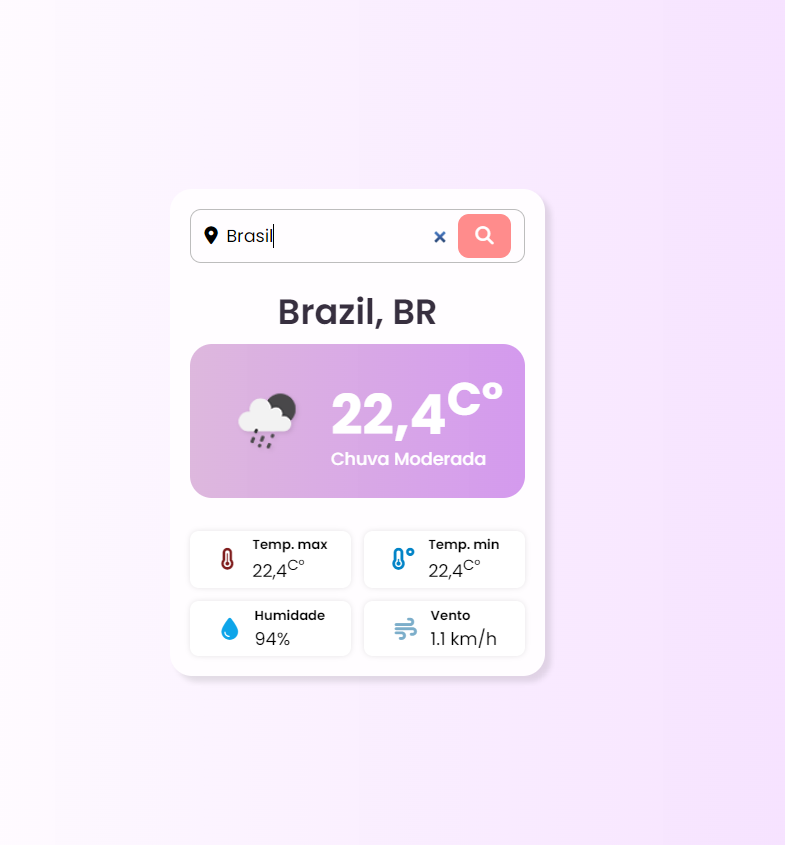

# ClimaTempo

🌤️ ClimaTempo
Uma aplicação que consulta a previsão do tempo usando a API do OpenWeather. Desenvolvida com HTML, CSS e JavaScript.

 🚀 Funcionalidades:
🔍 Consulta de previsão do tempo por cidade.
🌡️ Exibição de temperatura, umidade e condições climáticas.
📅 Previsão para os próximos dias.

⚙️ Tecnologias Utilizadas:

HTML5 para a estrutura da página.

CSS3 para o estilo e responsividade.

JavaScript para consumir a API e manipular o DOM.

OpenWeather API para obter dados climáticos em tempo real.

 🔧 Como Rodar o Projeto:
Clone o repositório: 

 git clone https://github.com/Allan-Souza13/ClimaTempo.git

  
Abra o arquivo index.html no navegador.

🌐 API Utilizada

OpenWeather

